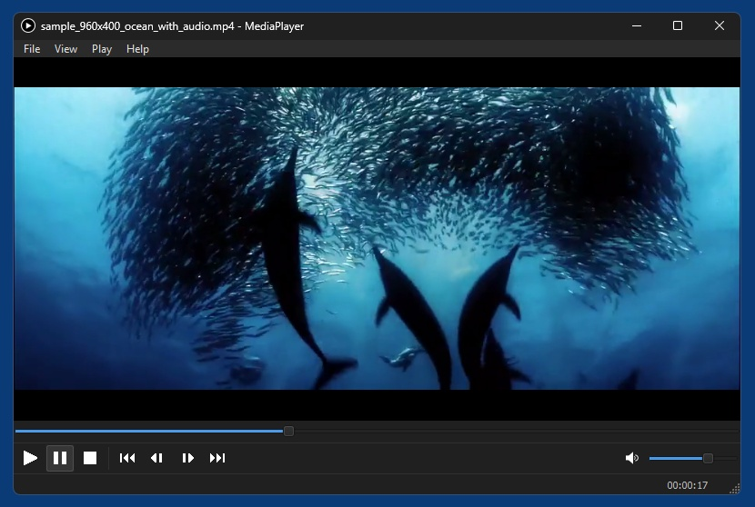
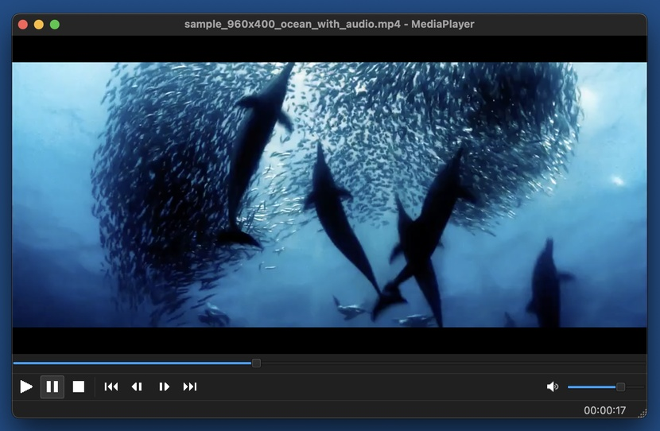

# MediaPlayer
A simple media player for macOS and Windows, based on Python 3, PyQt5 (portable to PyQt6 or PySide6) and a custom widget called VideoWidget that uses native system multimedia frameworks directly ([AVFoundation](https://developer.apple.com/av-foundation/) in macOS, DirectShow and [LAV Filters](https://github.com/Nevcairiel/LAVFilters) in Windows).

## Supported video containers
* **Windows**: 3gp asf asx avi dv f4v flv gif m2ts m4v mkv mov mp4 mpeg mts mxf ogv rm ts vob webm wmv wtv
* **macOS**: 3gp avi m2ts m2v m4v mov mp4 mpg mpeg mts mxf ts vob  
(mxf only when free [Pro Video Formats](https://support.apple.com/en-us/106396) are installed)  

## Supported audio containers
* **Windows**: aac ac3 aiff ape caf flac mp3 ogg sox wav
* **macOS**: aac ac3 aiff caf flac mp3 wav

## Supported video codecs (selection)
* **Windows**: bink cinepak dirac dvvideo flv1 (sorenson spark) fraps gif h264 hap1 hap5 hapy hevc indeo mjpeg mpeg1 mpeg2 mpeg4 msrle msvideo1 prores422 prores4444 qtrle theora vp4 vp6 vp7 wmv12 wmv3
* **macOS**: dvvideo h264 hevc mjpeg mpeg1 mpeg2 prores422 prores4444  
(+ [Pro Video Formats](https://support.apple.com/en-us/106396), if installed)

## Supported audio codecs (selection)
* **Windows**: aac ac3 alac dts flac mp2 mp3 nellymoser opus pcm realaudio truespeech vorbis wavpack wma
* **macOS**: aac ac3 alac flac mp2 mp3 pcm

## VideoWidget's API

### Signals
```
mediaReady                  -> bool success
mousePressed                -> None
doubleClicked               -> None
```
### Properties
```
filename                    -> the currently loaded file ur URL (full path)
```
### Methods
```
load_media(filename: str)
close_media()
step(steps: int)            -> step <steps> frames forward, or back if <steps> is negative
get_natural_size()          -> returns tuple (width, height) or None
get_duration()              -> returns seconds as float, or 0 if there is no duration (livestream)
get_fps()                   -> returns fps as float, or None if there is no framerate
has_video()                 -> returns bool (True or False)
has_audio()                 -> returns bool (True or False)
get_volume()                -> returns volume as float in range 0..1
set_volume(volume: float)   -> set volume as float in range 0..1
set_muted(flag: bool)       -> True mutes, False unmutes
seek_to_time(sec: float)    -> seek to time in seconds as float
get_time()                  -> returns current time in seconds as float (or None)
play()
pause()
toggle_playback()           -> returns True if player now playing, otherwise False
```

### Notes
You don't have to connect to signals mousePressed and doubleClicked, but you *always* have to connect to signal mediaReady, since loading a media file is asynchronous in macOS/AVFoundation. So when loading a file with load_media(), you always have to wait until mediaReady is emitted, and if 'success' was True, you can go on and now do stuff with the loaded media, if it was False then something went wrong, i.e. the file couldn't be loaded.

## Screenshots

*MediaPlayer in Windows 11*  


*MediaPlayer in macOS 13*  

